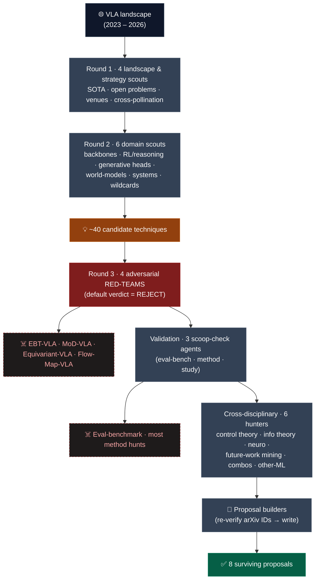
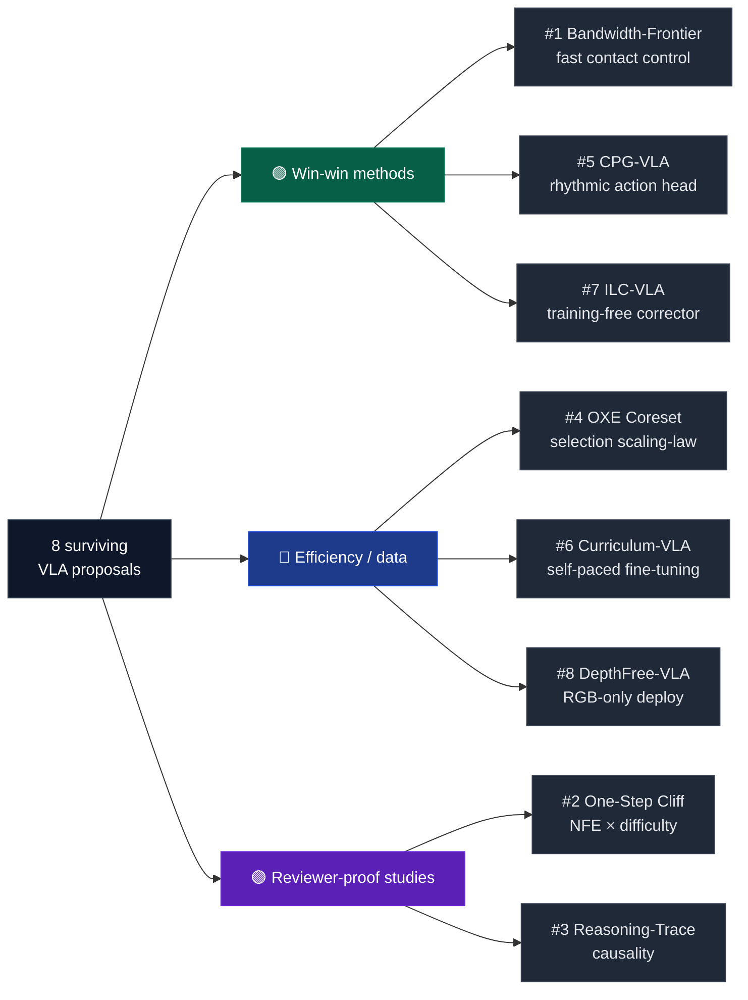
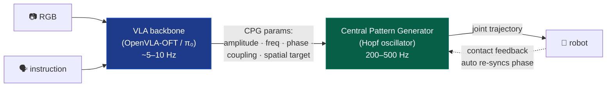

<div align="center">

# Vision-Language-Action (VLA) Research Proposal Portfolio

**Eight novel, scoop-checked VLA research directions — and the adversarial multi-agent funnel that produced them.**


</div>

---

## What this is

This repository is a **filtered portfolio of research proposals** for Vision-Language-Action (VLA) models — the transformer/flow policies (OpenVLA, π₀, RDT, GR00T, …) that map camera + language → robot actions.

It is **not** a brainstorm dump. Every idea here is the survivor of a deliberately brutal pipeline: dozens of candidate ideas were generated across the whole AI landscape, then **attacked by adversarial "Reviewer-2" agents whose default verdict was *reject*** and cross-checked against the live (2025–2026) arXiv literature for scooping. ~16 strong-looking ideas were **killed**; 8 survived. Each surviving proposal is a self-contained pitch with a precise novelty delta, an honest win-win scorecard, a week-1 de-risking experiment, and explicit kill-criteria.

> ⚠️ **Snapshot caveat.** VLA is moving at ~1 paper / subarea / 3 weeks. This snapshot reflects the literature as of **May 2026**. Re-verify every arXiv ID and re-run the scoop checks before committing to any direction — a few proposals carry short "scoop fuses" (flagged inline).

---

## How these proposals were produced



**Figure 1 — The adversarial funnel.** ~40 candidate techniques entered; four red-team agents (whose default was *reject*) and three scoop-check validators killed the crowded/scooped ones (EBT, Mixture-of-Depths, equivariant VLA, flow-map heads, yet-another eval benchmark, …); a final cross-disciplinary sweep mined *less-hyped* fields (classical control, information theory, neuroscience) and authors' own "future work" sections, where genuine white space still exists. Eight proposals survived. Full details: **[docs/methodology.md](docs/methodology.md)** · the complete kill list with the paper that scooped each idea: **[docs/research-log.md](docs/research-log.md)**.

> 📚 **Full research intelligence** gathered along the way — the VLA landscape map, ranked open problems, the benchmark catalog & its flaws, publication strategy, and a cross-domain technique survey with win-win scorecards — is preserved in the **[Knowledge Base → docs/knowledge-base/](docs/knowledge-base/README.md)**.

---

## The 8 proposals

Win-win axes: **N**ovel · **B**etter performance · **C**heaper (less compute/data) · **F**aster. (`✓` = yes, `~` = partial/conditional, `?` = plausible-but-unproven.)

### 🟢 Group A — Win-win methods (better *and* cheaper *and* faster)

| # | Proposal | One-line | N·B·C·F | Scoop risk | Feasibility |
|---|----------|----------|:-------:|:----------:|:-----------:|
| 1 | [Bandwidth-Frontier VLA](proposals/01-bandwidth-frontier-vla.md) | VLA emits a low-rate force/impedance *reference*; a ≥200 Hz analytic-admittance + 1-layer residual closes the loop — reported as a **control-bandwidth frontier** | ✓·?·✓·✓ | 🟠 med (short fuse) | 🟡 med (sim-first) |
| 5 | [CPG-VLA](proposals/05-cpg-vla-rhythmic-action-head.md) | Replace the action-chunk decoder with a **Central Pattern Generator** head for rhythmic/contact tasks (wiping, polishing, screwing) | ✓·✓·✓·✓ | 🟢 low | 🟢 high |
| 7 | [ILC-VLA](proposals/07-ilc-vla-training-free-corrector.md) | **Iterative Learning Control** as a *training-free* feed-forward residual corrector for repeated tasks — zero gradients | ✓·✓·✓·✓ | 🟢 low | 🟢 high |

### 🔵 Group B — Efficiency / data-centric

| # | Proposal | One-line | N·B·C·F | Scoop risk | Feasibility |
|---|----------|----------|:-------:|:----------:|:-----------:|
| 4 | [OXE-Scale Coreset](proposals/04-oxe-scale-coreset-scaling-law.md) | Cheap proxy scores → an Open-X coreset that matches the full mix at a fraction of data/compute; a **selection scaling-law** | ~·~·✓·✓ | 🔴 high | 🟡 med |
| 6 | [Curriculum-VLA](proposals/06-curriculum-vla-self-paced.md) | **Self-paced** demo ordering (difficulty = the VLA's own loss) → same success in 30–50% fewer gradient steps | ✓·?·✓·✓ | 🟠 low-med | 🟢 high |
| 8 | [DepthFree-VLA](proposals/08-depthfree-vla-depth-distillation.md) | Train-time **depth distillation** (Depth-Anything-V2 teacher) so the VLA deploys **RGB-only** with implicit 3D priors | ~·✓·~·= | 🔴 high (QDepth-VLA) | 🟡 med |

### 🟣 Group C — Reviewer-proof studies (understanding, not a method — hard to scoop)

| # | Proposal | One-line | Type | Scoop risk | Feasibility |
|---|----------|----------|------|:----------:|:-----------:|
| 2 | [The One-Step Generative Cliff](proposals/02-one-step-generative-cliff.md) | A controlled **NFE × difficulty** sweep: does "one-step" action generation stay safe off saturated LIBERO? | characterization | 🟢 low | 🟢 high |
| 3 | [Reasoning-Trace Causality](proposals/03-reasoning-trace-causality.md) | Causal-intervention ladder: do VLA reasoning traces help via **content**, or just test-time compute + train-time regularization? | causal study | 🟠 med (partial) | 🟡 med-high |

---

## Proposal taxonomy at a glance



**Figure 2 — Taxonomy.** The portfolio deliberately spreads risk: Group A chases the "true win-win method" the user wanted (highest reward, some scoop exposure); Group B targets clean efficiency/data wins; Group C are characterization studies that are *hard to scoop* because they sell understanding, not a technique — the safest acceptance bets.

---

## Architecture example — the recurring "two-rate" idea

Several Group-A proposals share a structural insight: a heavy VLM/VLA backbone is too slow for high-frequency contact control, so a **tiny fast inner loop** runs between backbone calls. Figure 3 shows it for **CPG-VLA (#5)**.



**Figure 3 — CPG-VLA two-rate control.** The backbone is queried only a few times per second to set *what kind* of rhythmic motion to produce; the lightweight oscillator generates the actual high-rate trajectory and re-synchronizes its phase on contact — giving faster control, lower compute, and a strong periodic inductive bias (fewer demos) on rhythmic tasks. The same fast/slow decomposition underlies **#1 Bandwidth-Frontier** and **#7 ILC-VLA**.

---

## How to use a proposal

Each `proposals/0N-*.md` is structured identically:

- **TL;DR** → **The Gap / Motivation** → **Precise novelty & positioning** (a table of the closest prior work + arXiv IDs + our delta)
- **Method / Hypothesis** → **Experimental design** (models, benchmarks, metrics, baselines, ablations)
- **Why it's publishable** (+ target venue) → **Honest win-win scorecard** → **Risks & kill-criteria**
- **First de-risking experiment** (a concrete week-1 go/no-go) → **Feasibility** → **Key references**

Start with the **First de-risking experiment** — it is designed as a cheap pass/fail gate. If it fails the stated kill-criterion, the proposal tells you to stop. Proposals **#3** and **#8** open with an explicit **⚠️ scoop-alert** documenting the closest competing work and the surviving defensible delta — read those first for those two.

---

## Repository layout

```
propo/
├── README.md            ← you are here
├── LICENSE              ← CC-BY-4.0
├── proposals/           ← the 8 proposals (01 … 08)
└── docs/
    ├── methodology.md   ← the full multi-agent funnel
    ├── research-log.md  ← the kill-list: every rejected idea + the paper that scooped it
    ├── bibliography.md  ← consolidated arXiv references
    └── knowledge-base/  ← full research intelligence (landscape, open problems,
                            publication strategy, technique survey, red-team analyses)
```

## Honest disclaimers

- **Not peer-reviewed; not executed.** These are *proposals*. No experiments have been run; reported numbers from prior work are cited, not reproduced.
- **Re-verify arXiv IDs.** They were checked by automated agents against May-2026 search results; a handful of very recent IDs should be confirmed on arxiv.org before you cite them.
- **Scoop fuses are real.** Group-A/B methods sit in fast-moving subareas. #8 is already scoop-adjacent (QDepth-VLA); #3 is partially scooped (flagged). The Group-C studies are the most durable.

## License & attribution

Released under **[CC-BY-4.0](LICENSE)** — reuse freely with attribution. Author: **lexus-x**. If a proposal here informs your work, a citation/link back is appreciated.
