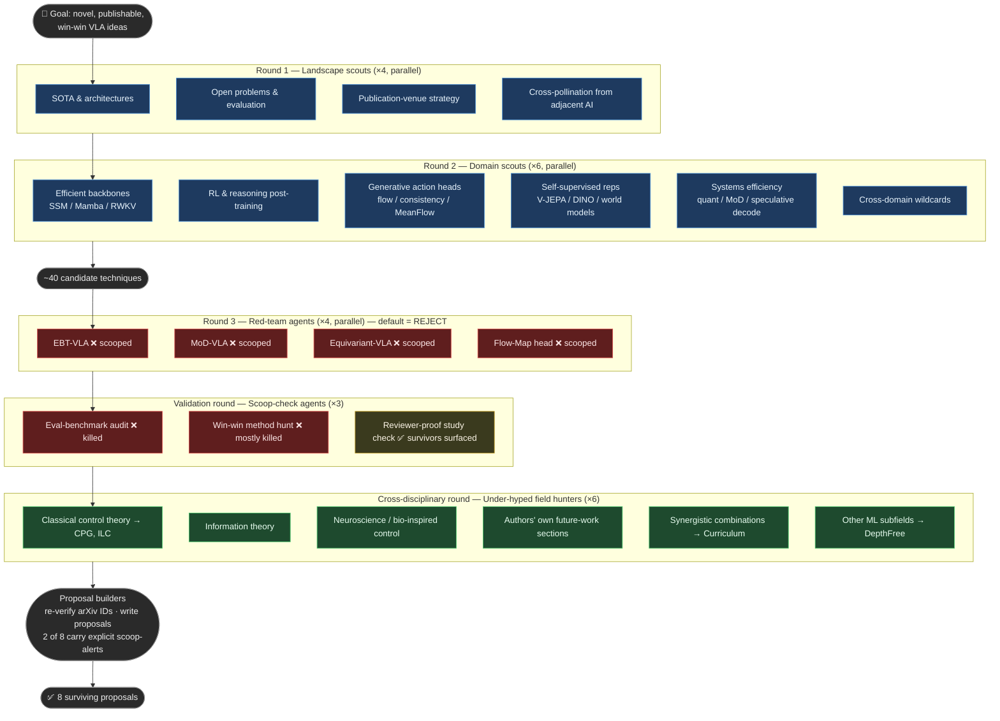

# Methodology — How the 8 Proposals Were Produced

[← Back to README](../README.md)

## Goal and philosophy

The objective was to identify novel Vision-Language-Action (VLA) research ideas that are genuinely publishable and ideally "win-win": novel contribution + measurable performance gain + reduced compute + faster inference. Every candidate was subjected to adversarial self-critique with a **default verdict of REJECT**, and every surviving idea was scoop-checked against live arXiv preprints before a proposal was written. The funnel converted roughly 40 candidate techniques into 8 surviving proposals.

---

## The adversarial funnel

*Figure — the adversarial funnel: from landscape scanning to 8 reviewer-hardened proposals.*

---

## Rounds at a glance

| Round | Agents | What they did | Outcome |
|-------|--------|---------------|---------|
| **1 — Landscape scouts** | 4 (parallel) | Mapped VLA SOTA & architectures; catalogued open problems; analysed publication-venue strategy; imported ideas from adjacent AI fields | Strategic finding: VLA is conference-dominated (CoRL / RSS / NeurIPS / ICLR / RA-L); analysis, benchmark, and efficiency papers have the best acceptance-odds-per-effort for academic labs |
| **2 — Domain scouts** | 6 (parallel) | Deep-dived efficient backbones (SSM/Mamba/RWKV), RL & reasoning post-training, generative action heads, self-supervised representations & world models, systems efficiency, and cross-domain wildcards | ~40 candidate techniques enumerated |
| **3 — Red-teams** | 4 (parallel) | Each agent was seeded with a leading method idea and tasked to kill it by finding prior or concurrent work on arXiv | All four front-runners eliminated: EBT-VLA, Mixture-of-Depths-VLA, calibration-free Equivariant-VLA, and Flow-Map action head each scooped by Feb–Apr 2026 preprints |
| **Validation** | 3 (parallel) | Scoop-checked eval-benchmark ideas; hunted win-win methods; stress-tested reviewer-proof characterisation studies | Eval-benchmark corner killed (most-saturated); most method hunts failed; strongest reviewer-proof studies surfaced |
| **Cross-disciplinary hunters** | 6 (parallel) | Mined classical control theory, information theory, neuroscience/bio-inspired control, authors' own future-work sections, synergistic combinations, and other ML subfields | Genuinely novel survivors identified: CPG rhythmic primitives, Iterative Learning Control, Curriculum strategies, DepthFree perception |
| **Proposal builders** | 1 per proposal | Re-verified every closest-competitor arXiv ID; wrote full structured proposals | 8 final proposals; 2 carry explicit scoop-alerts for transparency |

---

## Why this design

**Default-to-reject red-teaming.** The agents were explicitly told that the null verdict is REJECT, not "probably fine." This inverts the natural bias toward optimism that inflates candidate pools. A proposal only survives if no red-team agent can find a convincing kill shot.

**Live scoop-checking against arXiv.** Robot learning moves fast — preprints close technique gaps roughly every three weeks. Checking at the time of writing, not retrospectively, is what separated the four killed front-runners from the eight survivors.

**The cross-disciplinary pivot.** Hyped sub-fields (flow-matching heads, MoE routing, equivariance) are heavily surveilled by large, well-resourced labs; white space closes within weeks of any public discussion. By contrast, classical control theory (CPG, ILC), information-theoretic analysis, and neuroscience-inspired architectures are under-indexed by the VLA community. Systematically mining these less-hyped domains — and explicitly reading authors' own stated future-work sections — is what produced the durable novelty in the final eight.

---

## Meta-lesson

The "win-win novel benchmark-shattering method" is the most-contested, most-scooped target in robot learning. The hyped core of the field — new action heads, new backbone routing, new equivariant representations — is surveilled by dozens of well-funded groups, and preprints arrive fast enough to invalidate a promising idea before a submission deadline. Durable publication opportunities for academic labs lie in two places: **(a) under-hyped cross-disciplinary imports**, where classical or adjacent knowledge has not yet been competently translated into the VLA setting, and **(b) characterisation and understanding studies**, which sell insight rather than racing a technique and whose conclusions do not become false when a newer model appears.

---

## Limitations of the process

- All scouting and red-teaming was performed by automated agents; arXiv coverage and citation graphs are not exhaustive, and **every cited arXiv ID should be manually verified** before submission.
- The novelty assessment is a snapshot as of **May 2026**; the field moves quickly and the landscape may have shifted by the time any proposal reaches a submission deadline.
- Two proposals carry explicit scoop-alerts acknowledging partial overlap with known concurrent work; those risks should be weighed carefully before investing effort.
